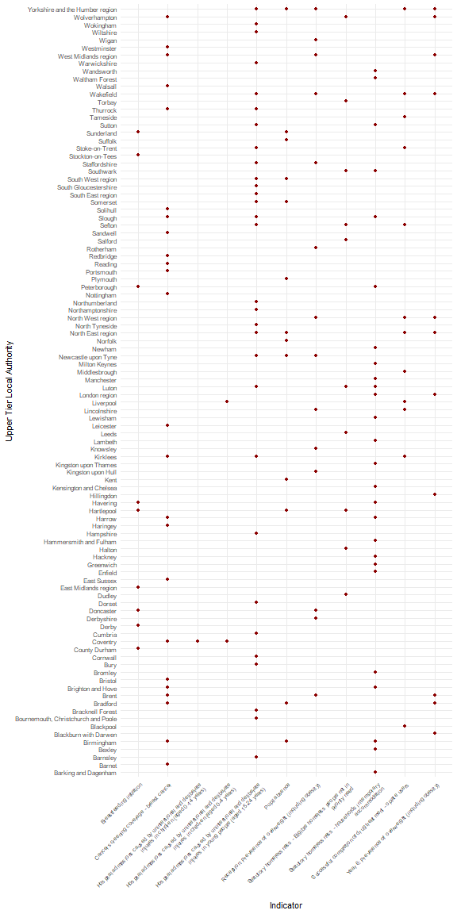

# Interactively selecting indicators

``` r

knitr::opts_chunk$set(fig.path = "charts-")
```

This short example introduces two new features included in the 0.1.1
version of the package:

- interactively selecting indicators
- highlighting the areas for each indicator that are deteriorating and
  are already statistically significantly worse than the England (or
  parent) value

The following libraries are needed for this vignette:

``` r

library(fingertipsR)
library(ggplot2)
```

To begin with, we want to select the indicators that we want to analyse
in this example. The
[`select_indicators()`](https://docs.ropensci.org/fingertipsR/reference/select_indicators.md)
function helps us do this:

``` r

inds <- select_indicators()
```

After running the above code a browser window opens and will spend some
time loading while it accesses the available indicators. Once loaded,
the search bar in the top right corner allows the user to type in any
searches to help locate the indicators of interest. This example will
use the following indicators, selected at random, which belong to the
Public Health Outcomes Framework profile. Note, the indicator IDs of the
selected indicators are displayed on the left-hand side. The user can
click an indicator for a second time to deselect the indicator if it has
been selected unnecessarily.

    ##  [1] 90630 10101 10301 92313 10401 11401 10501 92314 11502 10601 20101 20201 20601 20301 20602 90284 90832
    ## [18] 90285 22001 22002 90244

The second function to be highlighted in this vignette is
[`fingertips_redred()`](https://docs.ropensci.org/fingertipsR/reference/fingertips_redred.md).
This will return a data frame of the data for all of the areas that are
performing significantly worse than the chosen benchmark and are
deteriorating.

``` r

df <- fingertips_redred(inds, AreaTypeID = 202, Comparator = "England")
```

The
[`geom_tile()`](https://ggplot2.tidyverse.org/reference/geom_tile.html)
function from `ggplot2` can be used to visualise the poorly performing
areas:

``` r

df$IndicatorName <- sapply(strwrap(df$IndicatorName, 60, 
                                   simplify = FALSE), 
                           paste, collapse= "\n")
p <- ggplot(df, aes(IndicatorName, AreaName)) + 
        geom_point(colour = "darkred") + 
        theme_minimal() +
        theme(axis.text.x = element_text(angle = 45,
                                         hjust = 1,
                                         size = rel(0.85)),
              axis.text.y = element_text(size = rel(0.9))) +
        labs(y = "Upper Tier Local Authority",
             x = "Indicator")
print(p)
```



plot of chunk redred
